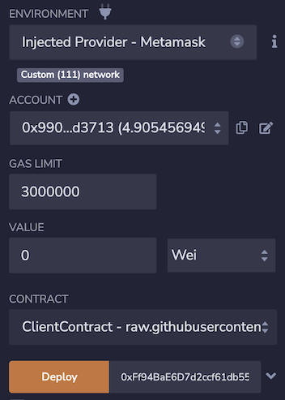
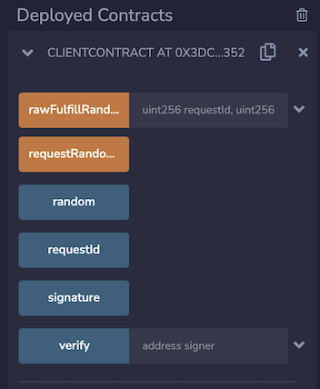

# Get Randomness

Following this tutorial, you'll learn how to write a smart contract consuming
randomness from Cryptosat Random Beacon contract.

## Create and deploy contract

For this example, use [ClientContract.sol](https://remix.ethereum.org/#url=https://raw.githubusercontent.com/cryptosat/randomness/main/contracts/ClientContract.sol) sample contract

1. Open [`ClientContract.sol` in Remix](https://remix.ethereum.org/#url=https://raw.githubusercontent.com/cryptosat/randomness/main/contracts/ClientContract.sol)

2. Compile the contract on the Compile tab.

   

3. Deploy your contract with Random Beacon contract address

   Select `Injected Web3` environment and fill in `0x1B23bcFc2Ec7b2259c90D4d96bc4aFAB75Da0ccF` for the Beacon Address

   

   MetaMask will ask you to confirm the transaction.

4. After you deploy your contract, you can interact with it.

   Click on getRandom button to retrieve randomness, then click 'randomness',
   'signature', and 'signer' buttons to check the values.

   
